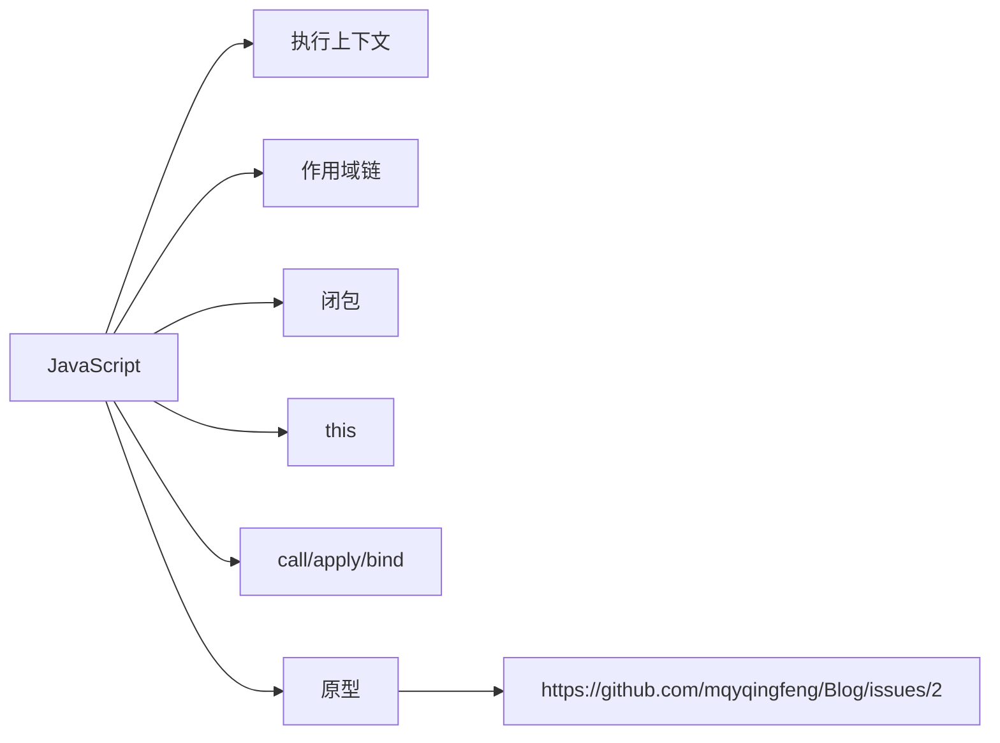
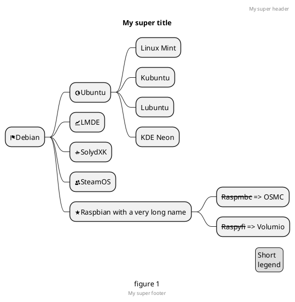

```mermaid
graph LR
	JavaScript--> 执行上下文
	JavaScript--> 作用域链
	JavaScript--> 闭包
	JavaScript--> this
	JavaScript--> call/apply/bind
	JavaScript--> 原型
	原型 -->https://github.com/mqyqingfeng/Blog/issues/2
```

```plantuml
@startuml
@startmindmap
caption figure 1
title My super title

* <&flag>Debian
** <&globe>Ubuntu
*** Linux Mint
*** Kubuntu
*** Lubuntu
*** KDE Neon
** <&graph>LMDE
** <&pulse>SolydXK
** <&people>SteamOS
** <&star>Raspbian with a very long name
*** <s>Raspmbc</s> => OSMC
*** <s>Raspyfi</s> => Volumio

header
My super header
endheader

center footer My super footer

legend right
  Short
  legend
endlegend
@endmindmap
@enduml

```
