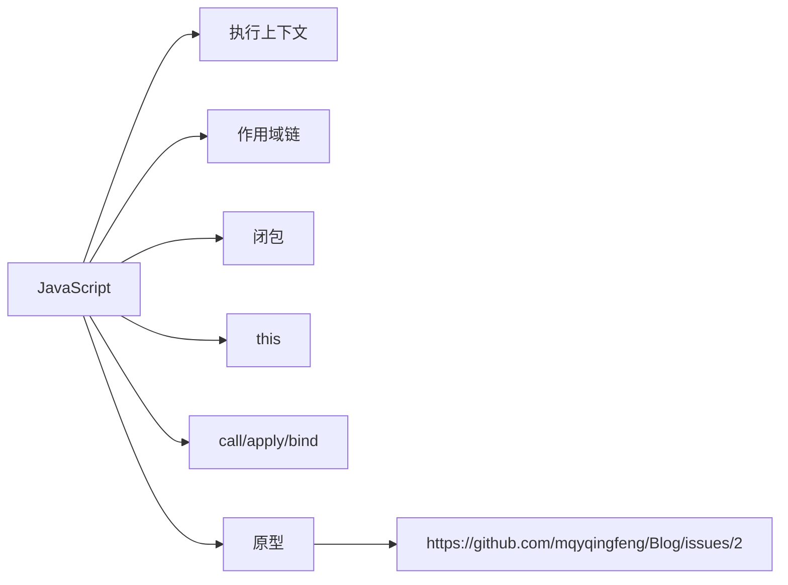
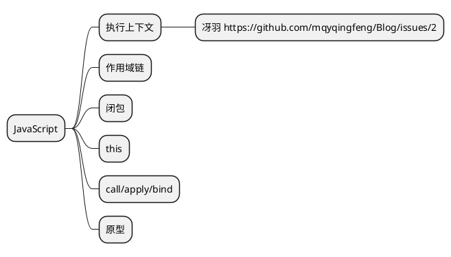

```mermaid
graph LR
	JavaScript--> 执行上下文
	JavaScript--> 作用域链
	JavaScript--> 闭包
	JavaScript--> this
	JavaScript--> call/apply/bind
	JavaScript--> 原型
	原型 -->https://github.com/mqyqingfeng/Blog/issues/2
```

```plantuml
@startmindmap
* JavaScript
	* 执行上下文
		* 冴羽 https://github.com/mqyqingfeng/Blog/issues/2
	* 作用域链
	* 闭包
	* this
	* call/apply/bind
	* 原型
@endmindmap
```

@startwbs
* 今天做个好人
** 扶老奶奶过马路
*** 在菜市场旁边的红绿等蹲守
*** 寻找腿脚不利索要过马路的老奶奶
*** 扶过马路
** 帮张大爷拿快递
*** 问张大爷快递信息
*** 去收发室
*** 拿给张大爷并要寄存费
** 不拿秀秀的钱
@endwbs