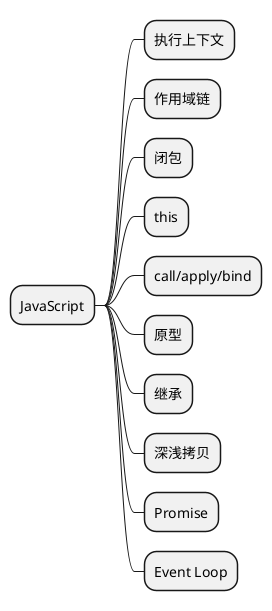

## 👨🏻‍💻 导图

## 📒 整理

#### 执行上下文

- JavaScript 深入之从原型到原型链——冴羽 [https://github.com/mqyqingfeng/Blog/issues/2](https://github.com/mqyqingfeng/Blog/issues/2)

#### 作用域链

- JavaScript 深入之作用域链——冴羽 [https://github.com/mqyqingfeng/Blog/issues/6](https://github.com/mqyqingfeng/Blog/issues/6)

#### 闭包

- JavaScript 深入之闭包——冴羽 [https://github.com/mqyqingfeng/Blog/issues/9](https://github.com/mqyqingfeng/Blog/issues/9)

#### this

#### call/apply/bind

#### 原型

#### 继承

#### 深浅拷贝

#### Promise
- 这一次，彻底弄懂 Promise 原理——掘金 [https://juejin.cn/post/6844904063570542599](https://juejin.cn/post/6844904063570542599)

#### Event Loop
