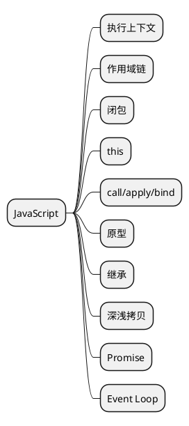

## 👨🏻‍💻 导图

## 📒 整理

#### 执行上下文

- JavaScript 深入之从原型到原型链——冴羽 [https://github.com/mqyqingfeng/Blog/issues/2](https://github.com/mqyqingfeng/Blog/issues/2)

#### 作用域链

- JavaScript 深入之作用域链——冴羽 [https://github.com/mqyqingfeng/Blog/issues/6](https://github.com/mqyqingfeng/Blog/issues/6)

#### 闭包

- JavaScript 深入之闭包——冴羽 [https://github.com/mqyqingfeng/Blog/issues/9](https://github.com/mqyqingfeng/Blog/issues/9)

#### this
- JavaScript深入之从ECMAScript规范解读this——冴羽 [https://github.com/mqyqingfeng/Blog/issues/7](https://github.com/mqyqingfeng/Blog/issues/7)

#### call/apply/bind
- 细说 call、apply 以及 bind 的区别和用法——segmentfault [https://segmentfault.com/a/1190000018017796](https://segmentfault.com/a/1190000018017796)

#### 原型

#### 继承

#### 深浅拷贝

#### Promise
- 这一次，彻底弄懂 Promise 原理——掘金 [https://juejin.cn/post/6844904063570542599](https://juejin.cn/post/6844904063570542599)

#### Event Loop
- 详解JavaScript中的Event Loop（事件循环）机制——知乎 [https://zhuanlan.zhihu.com/p/33058983](https://zhuanlan.zhihu.com/p/33058983)
