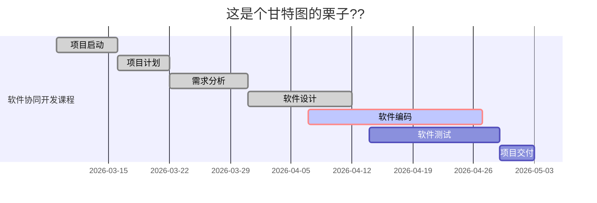

### 📒 待整理
- vscode 自动格式化md文件，搞得很是郁闷，加入 [markdown] 自定义配置 "editor.formatOnSave": false 搞定了。 https://www.cnblogs.com/pengchenggang/p/14917817.html
- vuepress markdown 拓展 https://blog.dbplayer.org/my-blog/

