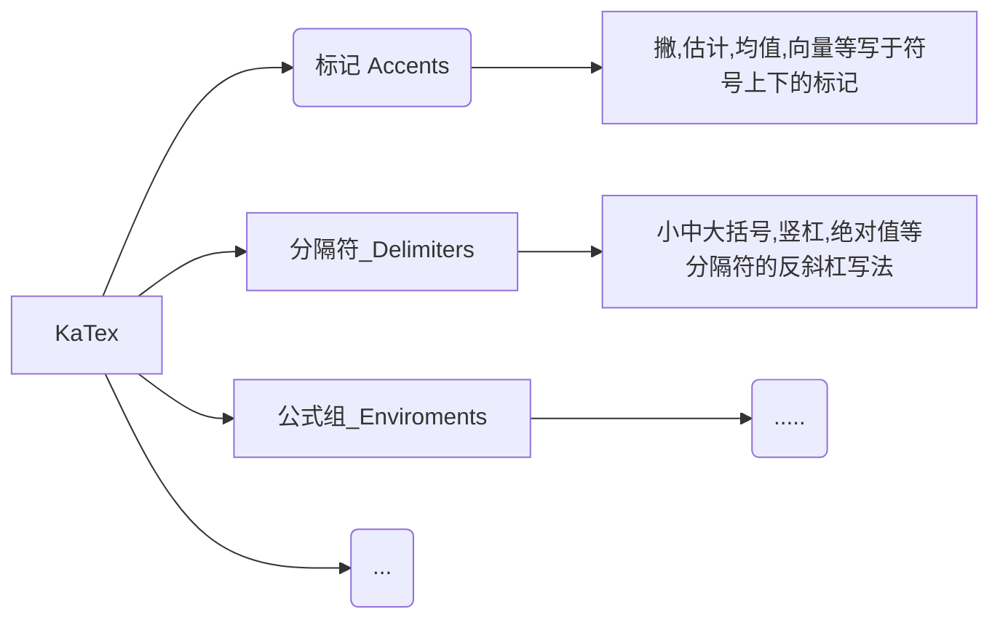
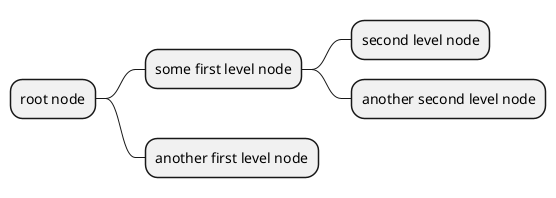
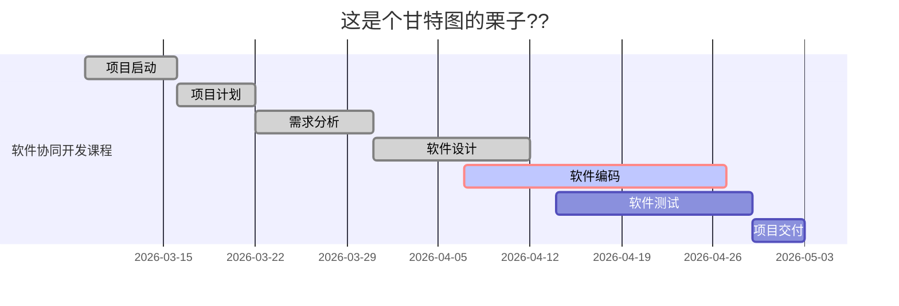

```mermaid
graph LR
	KaTex--> A(标记 Accents) 
	A-->撇,估计,均值,向量等写于符号上下的标记
	KaTex--> 分隔符_Delimiters
	分隔符_Delimiters-->小中大括号,竖杠,绝对值等分隔符的反斜杠写法
	KaTex--> 公式组_Enviroments
	公式组_Enviroments-->B(.....)
	KaTex-->C(...)
```

```plantuml
@startmindmap
<style>
mindmapDiagram {
  .green {
    BackgroundColor lightgreen
  }
  .rose {
    BackgroundColor #FFBBCC
  }
  .your_style_name {
    BackgroundColor lightblue
  }
}
</style>
* root node
	* some first level node
		* second level node
		* another second level node
	* another first level node
@endmindmap
```

```mermaid
gantt
title 这是个甘特图的栗子??

dateFormat MM-DD

section 软件协同开发课程
项目启动 :done,des1,03-09,7d
项目计划 :done,des2,after des1,6d
需求分析 :done,des3,after des2,9d
软件设计 :done,des4,after des3,12d
软件编码 :crit,active,des5,04-07,20d
软件测试 :des6,04-14,15d
项目交付 :des7,after des6,4d
```

